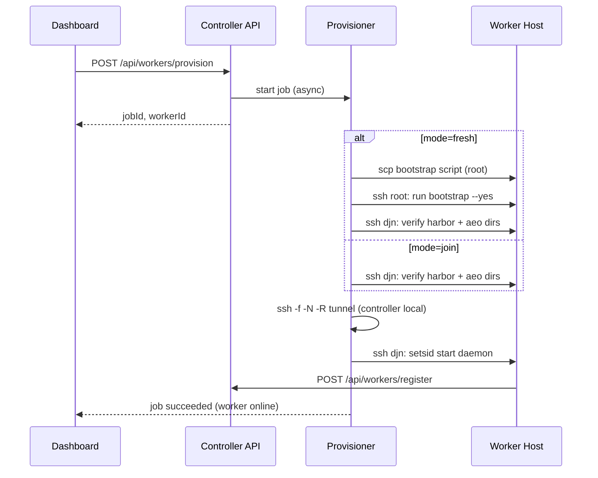

# Worker Provision UI Design

## Goal

Add an **Add Worker** flow to the Controller dashboard that remotely provisions worker nodes over SSH. Operators choose between two deployment modes on the frontend:

1. **Fresh install** — bootstrap a new ECS (Ubuntu 22.04) from root, then start tunnel + daemon.
2. **Join existing** — connect to an already-bootstrapped host, then start tunnel + daemon only.

The Controller orchestrates all remote steps. Workers appear in the existing Workers list after `register` succeeds.

## Non-Goals

This feature will **not**:

- Sync evaluation datasets, `bitfun-cli`, or agent config to workers (separate feature later).
- Store SSH private keys or passwords in SQLite (except one-time `djnPassword` in the provision request body, never persisted).
- Edit or manage `~/.ssh/config` from the UI (admins configure SSH out of band).
- Create systemd units for tunnel or daemon (use `setsid` / background `ssh -f -N`).
- Auto-recover tunnels after Controller restart.
- Open cloud firewall or security group ports.
- Replace manual worker registration — daemons still self-register via existing protocol.

## Chosen Approach

Use **subprocess + OpenSSH** (`ssh`, `scp`) with connection parameters read from the Controller process user's SSH config file. Store only **Host alias references** and provisioning metadata in SQLite. Run provisioning as **async jobs** polled by the frontend.

Alternatives considered:

| Approach | Verdict |
|----------|---------|
| subprocess + OpenSSH | **Chosen** — no new deps, matches README, ProxyJump works |
| paramiko / asyncssh | Rejected — duplicates SSH config, key handling in app |
| Remote deploy agent | Rejected — over-engineered for fixed worker fleet |

## SSH Credential Strategy

### Principle

- **Private keys and passphrases never enter the database.**
- Admins preconfigure `~/.ssh/config` (or a path passed to Controller via `--ssh-config`).
- The database stores `ssh_host_alias` (and optionally `ssh_bootstrap_host_alias`) as opaque references.

### Example admin SSH config

```sshconfig
Host aeo-ecs-0004-root
    HostName 192.168.0.244
    User root
    IdentityFile ~/.ssh/aeo_admin

Host aeo-ecs-0004
    HostName 192.168.0.244
    User djn
    IdentityFile ~/.ssh/aeo_workers
```

### Controller configuration

| Flag / env | Default | Purpose |
|------------|---------|---------|
| `--ssh-config` | `~/.ssh/config` | SSH config file to parse and pass to `ssh -F` |

### Pre-flight validation

Before starting a provision job:

1. Parse config and resolve `HostName`, `User`, `Port`, `IdentityFile` via `ssh -G <alias>`.
2. Test connectivity: `ssh -o BatchMode=yes -o ConnectTimeout=10 <alias> echo ok`.
3. Surface clear UI errors if alias is missing or auth fails.

## Architecture

```text
Dashboard (Workers tab)
    │
    ├─ GET  /api/ssh/hosts          → list Host aliases from SSH config
    ├─ POST /api/ssh/test           → test one alias
    ├─ POST /api/workers/provision  → create worker row + start job
    └─ GET  /api/workers/provision/{jobId}  → poll status + log tail

Controller API
    │
    └─ Provisioner (controller/provisioner.py)
           ├─ SSH config parser
           ├─ Job runner (background thread)
           ├─ Tunnel manager (local ssh -f -N -R)
           └─ Remote command templates
```

### End-to-end sequence



## Frontend: Add Worker Wizard

### Entry point

Workers tab panel header: **添加 Worker** button next to the Workers title.

### Modal fields

| Field | Required | Notes |
|-------|----------|-------|
| Worker ID | yes | Unique, e.g. `ecs-worker-0004` |
| Display name | no | Defaults to Worker ID |
| Slots | yes | Default `1` |
| Deploy mode | yes | Radio: `全新安装` / `仅接入` |
| SSH Host (djn) | yes | Select or type Host alias |
| SSH Host (root) | fresh only | Bootstrap SSH alias; hint to use `-root` suffix |
| DJN password | fresh only | One-time; sent in POST body only |
| Tunnel remote port | no | Default `17380` |

### Deploy progress UI

After submit, show step list + log tail (poll every 2s):

| Step | Fresh | Join |
|------|-------|------|
| Validate SSH | ✓ | ✓ |
| Bootstrap system | ✓ | — |
| Verify worker layout | ✓ | ✓ |
| Establish reverse tunnel | ✓ | ✓ |
| Start worker daemon | ✓ | ✓ |
| Wait for register | ✓ | ✓ |

Actions: **Cancel** (best-effort cleanup), **Close** on success, **Retry** on failure.

### Worker list states

Workers mid-provision show badge `provisioning`. Failed provision shows `provision_failed` with link to last job log.

## Deployment Modes

### Mode A: Fresh install (`fresh`)

**Prerequisites**

- Target: Ubuntu 22.04.5 amd64 (same as bootstrap script).
- Controller can `ssh` to root Host alias.
- Operator supplies `djnPassword` for non-interactive bootstrap.

**Steps**

1. Copy `scripts/bootstrap-huawei-worker.sh` to remote `/tmp/aeo-bootstrap.sh`.
2. Run as root:
   ```bash
   DJN_PASSWORD='<from-request>' bash /tmp/aeo-bootstrap.sh --yes
   ```
3. As djn, verify:
   ```bash
   test -d /home/djn/worker/harbor
   test -d /home/djn/worker/agent-eval-orchestrator
   /home/djn/worker/.local/bin/uv --version
   ```
4. On Controller host, start reverse tunnel:
   ```bash
   ssh -f -N \
     -o ExitOnForwardFailure=yes \
     -o ServerAliveInterval=30 \
     -R <tunnelRemotePort>:127.0.0.1:<controllerPort> \
     <djnHostAlias>
   ```
5. As djn, start daemon in background (see Daemon startup template).
6. Poll `GET /api/workers` until worker status is `online` (register received), timeout 90s.

### Mode B: Join existing (`join`)

**Prerequisites**

- Bootstrap already completed on target.
- Controller can `ssh` to djn Host alias.

**Steps**

1. As djn, verify harbor + agent-eval-orchestrator directories (same checks as fresh step 3). Fail with actionable message if missing.
2. Establish reverse tunnel (same as fresh step 4).
3. Start daemon (same as fresh step 5).
4. Wait for register (same as fresh step 6).

## Daemon Startup Template

Remote command (values injected by Provisioner):

```bash
mkdir -p /home/djn/worker/logs
cd /home/djn/worker/agent-eval-orchestrator
setsid /home/djn/worker/.local/bin/uv run python -u -m agent_eval_orchestrator.worker.daemon \
  --controller-url "http://127.0.0.1:${TUNNEL_REMOTE_PORT}" \
  --worker-id "${WORKER_ID}" \
  --display-name "${DISPLAY_NAME}" \
  --host "$(hostname -f || hostname)" \
  --shared-root /home/djn/worker/agent-eval-orchestrator/runtime \
  --local-root "/home/djn/worker/agent-eval-orchestrator/runtime/workers/${WORKER_ID}/local" \
  --slots ${SLOTS} \
  --poll-interval 3 \
  --auth-token "${AEO_TOKEN}" \
  >> "/home/djn/worker/logs/daemon-${WORKER_ID}.log" 2>&1 &
```

- `AEO_TOKEN` read from Controller `--auth-token`; inject via SSH env, **never** write to job log.
- If `uv` path differs, resolve from bootstrap layout (`/home/djn/worker/.local/bin/uv`).

## Reverse Tunnel Management

Each provisioned worker gets one background `ssh -R` on the Controller host.

**Runtime record** (JSON under `controller/tunnels.json` or equivalent):

```json
{
  "ecs-worker-0004": {
    "djnHostAlias": "aeo-ecs-0004",
    "remotePort": 17380,
    "localPort": 7380,
    "sshPid": 12345,
    "startedAt": "2026-05-24T12:00:00+00:00"
  }
}
```

**Rules**

- Each worker machine uses its own `127.0.0.1:<remotePort>`; port `17380` may be reused across different hosts.
- On provision cancel/failure after tunnel start: attempt `kill` recorded `sshPid`.
- Controller restart: tunnels are **not** auto-restored in v1; UI shows warning on affected workers.

## API Contract

### `GET /api/ssh/hosts`

Response:

```json
{
  "sshConfigPath": "/home/djn/.ssh/config",
  "items": [
    {
      "hostAlias": "aeo-ecs-0004",
      "hostname": "192.168.0.244",
      "user": "djn",
      "port": 22
    }
  ]
}
```

Parse OpenSSH config; include only `Host` entries (skip `*` wildcards for v1).

### `POST /api/ssh/test`

Request:

```json
{ "hostAlias": "aeo-ecs-0004" }
```

Response:

```json
{ "ok": true, "message": "connected" }
```

or `{ "ok": false, "message": "Permission denied (publickey)." }`

### `POST /api/workers/provision`

Request:

```json
{
  "workerId": "ecs-worker-0004",
  "displayName": "ecs-worker-0004",
  "slotsTotal": 1,
  "mode": "fresh",
  "sshHostAlias": "aeo-ecs-0004",
  "sshBootstrapHostAlias": "aeo-ecs-0004-root",
  "djnPassword": "one-time-secret",
  "tunnelRemotePort": 17380
}
```

- `djnPassword` required when `mode=fresh`; ignored when `mode=join`.
- `sshBootstrapHostAlias` required when `mode=fresh`.

Response `201`:

```json
{
  "jobId": "prov-a1b2c3d4",
  "workerId": "ecs-worker-0004",
  "status": "pending"
}
```

Errors: `409` if `workerId` exists; `400` if SSH validation fails.

### `GET /api/workers/provision/{jobId}`

Response:

```json
{
  "jobId": "prov-a1b2c3d4",
  "workerId": "ecs-worker-0004",
  "mode": "fresh",
  "status": "running",
  "currentStep": "bootstrap",
  "steps": [
    { "id": "validate_ssh", "label": "校验 SSH 连接", "status": "succeeded" },
    { "id": "bootstrap", "label": "Bootstrap 系统环境", "status": "running" }
  ],
  "logTail": "... last 8KB of log ...",
  "errorText": null,
  "createdAt": "...",
  "finishedAt": null
}
```

### `POST /api/workers/provision/{jobId}/cancel`

Best-effort: mark job cancelled, kill tunnel if started, optionally `pkill -f "worker.daemon.*--worker-id <id>"` on remote.

## Data Model

### `workers` table — new columns

| Column | Type | Notes |
|--------|------|-------|
| `ssh_host_alias` | TEXT | djn Host alias |
| `ssh_bootstrap_host_alias` | TEXT NULL | root Host alias |
| `tunnel_remote_port` | INTEGER | Default 17380 |
| `provision_status` | TEXT | `none`, `provisioning`, `ready`, `failed` |
| `last_provision_error` | TEXT NULL | Last failure message |

Existing `register_worker` continues to update heartbeat; `provision_status` becomes `ready` when register succeeds after provision.

### New table `provision_jobs`

| Column | Type | Notes |
|--------|------|-------|
| `job_id` | TEXT PK | e.g. `prov-a1b2c3d4` |
| `worker_id` | TEXT FK | |
| `mode` | TEXT | `fresh` or `join` |
| `status` | TEXT | `pending`, `running`, `succeeded`, `failed`, `cancelled` |
| `current_step` | TEXT | |
| `steps_json` | TEXT | Serialized step list |
| `log_text` | TEXT | Append-only log |
| `error_text` | TEXT NULL | |
| `created_at` | TEXT | ISO8601 |
| `finished_at` | TEXT NULL | |

## Error Handling

| Scenario | Behavior |
|----------|----------|
| SSH alias not in config | Fail at validate step; no worker row or rollback insert |
| SSH auth failure | Job failed; `provision_status=failed` |
| Bootstrap script non-zero exit | Job failed; append stderr to log |
| Join mode: missing directories | Job failed; message suggests Fresh mode |
| Tunnel start failure | Job failed; do not start daemon |
| Daemon started but no register in 90s | Job failed; message points to remote log path |
| Duplicate workerId | HTTP 409 before job starts |
| Cancel mid-bootstrap | Mark cancelled; remote state may be partial; UI warns |

## Security

- Require Controller auth token for all provision APIs (same as existing dashboard).
- Never persist `djnPassword`; clear from memory after bootstrap step.
- Redact `--auth-token` and passwords from `log_text`.
- Provisioner runs SSH with `BatchMode=yes` (no interactive prompts).
- Controller OS user must have minimal SSH access: root for fresh bootstrap only, djn for routine ops.

## Testing

### Unit tests

- SSH config parser: Host blocks, Port, User, IdentityFile.
- Command template rendering for daemon and bootstrap.
- Job state machine transitions.
- Log redaction.

### Integration tests

- Mock `subprocess.run` / `Popen` to assert step order for fresh vs join.
- API tests for 409 duplicate worker, 400 bad alias.

### Manual acceptance

- [ ] Fresh: new Ubuntu 22.04 ECS → worker online in dashboard.
- [ ] Join: already-bootstrapped ECS → worker online without re-bootstrap.
- [ ] SSH failure shows clear error in UI.
- [ ] Cancel stops job and does not leave orphan tunnel (best effort).
- [ ] Worker receives tasks after provision (existing create-task flow).

## Implementation Notes

- New module: `src/agent_eval_orchestrator/controller/provisioner.py`
- New module: `src/agent_eval_orchestrator/controller/ssh_config.py` (parse + test)
- Extend `store.py` for worker columns + `provision_jobs` CRUD
- Extend `static.py` Workers tab UI (modal + polling)
- Controller CLI: add `--ssh-config` argument
- SQLite migration: additive columns + new table (inline `CREATE IF NOT EXISTS` pattern used elsewhere)

## Related Documents

- [Huawei ECS Worker Bootstrap Design](./2026-05-24-huawei-ecs-worker-bootstrap-design.md) — what Fresh mode runs remotely
- [README](../../../README.md) — manual tunnel + daemon flow this feature automates

## Future Work (out of scope)

- Dataset / bitfun / config sync from Controller
- systemd units for tunnel and daemon
- Auto-reconnect tunnels after Controller restart
- `WORKER_LOST` handling for stale batches
- UI editor for SSH config entries
