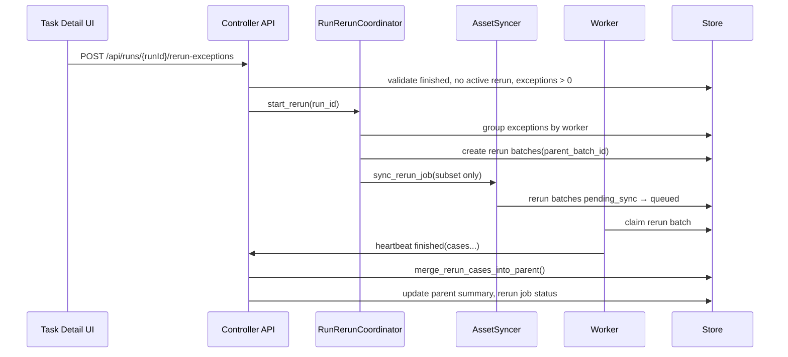

# Run Exception Rerun Design

## Goal

Add a **run-level exception rerun** feature. After a run has fully completed, operators can rerun all exception cases from the Task detail page. Each case runs on its **original worker**, assets are **re-synced automatically** for the rerun subset only, and successful results **overwrite** the previous exception case records in the parent batch.

## Non-Goals

This feature will **not**:

- Rerun failed cases (reward = 0.0, no exception).
- Rerun while the original run still has running batches.
- Allow multiple concurrent reruns on the same run.
- Add a Run-list shortcut or manual case subset selection.
- Change the worker claim protocol beyond new batch metadata fields.

## Requirements Summary

| Decision | Choice |
|----------|--------|
| Trigger timing | Only when all primary batches are terminal (`succeeded` / `failed` / `stopped`) |
| Rerun scope | Exception cases only (`status=errored`, or legacy `failed` + `error_text`) |
| Worker assignment | Same worker as the original parent batch |
| Asset handling | Auto re-sync before rerun; sync only rerun case subset (+ bitfun assets) |
| Batch model | New `exception_rerun` batch per worker; merge results back into parent batch |
| Concurrency | Multiple reruns over time allowed; **at most one in-progress rerun per run** |
| UI entry | Task detail page button: **重跑 Exception** |
| Result merge | Overwrite exception cases in parent `case_runs`; leave succeeded/failed cases unchanged |

## Chosen Approach

Use a **RunRerunCoordinator** (mirroring `AssetSyncer` / `Provisioner` job patterns):

1. Validate run is finished and has exception cases.
2. Group exception cases by original worker.
3. Create one rerun batch per worker (`batch_kind=exception_rerun`, `parent_batch_id` set).
4. Start scoped asset sync for rerun subsets.
5. Promote rerun batches to `queued` after sync.
6. On worker completion, merge rerun case results into the parent batch (not full replace).

Alternatives considered:

| Approach | Verdict |
|----------|---------|
| New rerun batch + merge into parent | **Chosen** — clear history, safe Harbor job isolation, matches overwrite requirement |
| Re-queue original batch with subset | Rejected — Harbor job dir collision, unclear audit trail |
| Rerun batch only, UI aggregation | Rejected — does not overwrite parent records |

## Architecture

```text
Task Detail UI
    │  click "重跑 Exception"
    ▼
POST /api/runs/{runId}/rerun-exceptions
    ├─ Validate: run finished, no in-progress rerun, exceptionCount > 0
    ├─ Create run_rerun_jobs row (status=pending)
    ├─ Group exception cases by worker
    ├─ Create exception_rerun batches (parent_batch_id linked)
    ├─ runs.rerun_status = syncing
    └─ Start scoped AssetSync job

AssetSyncer.sync_rerun_job()
    For each worker with exception cases:
      1. sync_cases  — only rerun case subdirs to {sharedRoot}/sync/{runId}/dataset/
      2. sync_bitfun — bitfun-cli + config (full bitfun re-sync is acceptable)
    On worker sync success:
      - rerun batch: pending_sync → queued

Worker claim + execute:
    - Harbor job_name = rerun batch_id (separate job dir from parent)
    - selected_case_ids = exception subset only

On rerun batch finished heartbeat:
    ├─ merge_rerun_cases_into_parent(parent_batch_id, rerun_cases)
    ├─ copy/overwrite trial dirs into parent harbor job dir
    ├─ recompute parent batch summary
    ├─ optional: re-merge combined harbor viewer job
    ├─ mark rerun batch succeeded
    └─ if all rerun batches done → run.rerun_status = succeeded|failed
```

### Sequence



## Data Model

### `runs` — new columns

| Column | Type | Description |
|--------|------|-------------|
| `rerun_status` | TEXT | `idle` / `syncing` / `running` / `succeeded` / `failed` |
| `rerun_job_id` | TEXT | Current or most recent rerun job ID |

### `batches` — new columns

| Column | Type | Description |
|--------|------|-------------|
| `parent_batch_id` | TEXT | Set on rerun batches; points to original primary batch |
| `batch_kind` | TEXT | `primary` (default) or `exception_rerun` |

### New table `run_rerun_jobs`

```sql
CREATE TABLE run_rerun_jobs (
    job_id              TEXT PRIMARY KEY,
    run_id              TEXT NOT NULL,
    status              TEXT NOT NULL,
    sync_job_id         TEXT,
    case_ids_json       TEXT NOT NULL,
    worker_shards_json  TEXT NOT NULL,
    rerun_batches_json  TEXT NOT NULL,
    error_text          TEXT,
    created_at          TEXT NOT NULL,
    finished_at         TEXT
);
```

### Exception case selection

From all `primary` batches in the run:

```python
Store._case_is_errored(case):
    status == "errored"
    OR (status == "failed" AND error_text)
```

Group by `assigned_worker_id`, fallback `preferred_worker_id` from the parent batch.

## API

### `POST /api/runs/{runId}/rerun-exceptions`

**Preconditions**

1. All primary batches terminal.
2. `run.rerun_status` not in `{syncing, running}`.
3. At least one exception case exists.

**Response `201`**

```json
{
  "rerunJobId": "rerun-abc123",
  "rerunStatus": "syncing",
  "exceptionCount": 14,
  "workerShards": {
    "ecs-worker-0001": 5,
    "ecs-worker-0002": 9
  }
}
```

**Errors**

| Code | Condition |
|------|-----------|
| 400 | No exception cases |
| 409 | Run not finished |
| 409 | Rerun already in progress |

### `GET /api/runs/{runId}/rerun`

Returns rerun job status, per-worker rerun batch progress, remaining exception count.

### `GET /api/eval-tasks/{runId}` extensions

- `run.rerunStatus`, `run.rerunJobId`
- `canRerunExceptions: boolean`
- batches include `batchKind`, `parentBatchId`

## Merge Rules

When a rerun batch completes, do **not** use the existing full-replace path in `update_batch_progress`.

New method: `Store.merge_rerun_cases_into_parent(parent_batch_id, rerun_cases, rerun_batch_id)`

1. Load existing parent `case_runs`.
2. For each case in `rerun_cases`:
   - Delete parent row with same `case_id`.
   - Insert new row with `batch_id = parent_batch_id` (preserve parent ownership).
3. Leave all non-rerun cases unchanged.
4. Recompute parent batch `summary` (`succeeded`, `failed`, `errored`).
5. Copy rerun Harbor trial directories into `parent_batch_root/harbor/jobs/{parent_batch_id}/`, overwriting prior exception trials.
6. If combined jobs dir is enabled, incrementally re-merge viewer artifacts.
7. Mark rerun batch `succeeded`; update `run.rerun_status` when all rerun batches finish.

If a rerun case is still an exception after merge, the new exception record replaces the old one. A subsequent rerun is allowed once the current rerun job reaches a terminal state.

All merge steps for a parent batch must run inside a DB transaction; on failure, do not leave partial parent updates.

## Asset Sync (Scoped Re-sync)

Reuse `AssetSyncer` with a new entry point `sync_rerun_job()`.

- Target root: `{workerSharedRoot}/sync/{runId}/` (same as initial run).
- Sync only rerun case subdirectories under `dataset/`.
- Re-sync bitfun-cli and config for each involved worker.
- On success: rerun batch `pending_sync → queued`.
- Rerun completion does **not** trigger another sync cleanup. Cleanup behavior stays aligned with existing run lifecycle rules.

## UI

### Task detail — **重跑 Exception** button

**Enabled when**

- Run finished.
- `exceptionCount > 0`.
- `rerunStatus` not in `{syncing, running}`.

**Disabled tooltips**

| Reason | Message |
|--------|---------|
| Run not finished | Run 尚未全部完成 |
| No exceptions | 没有需要重跑的 exception case |
| Rerun in progress | 已有重跑任务进行中 |

**Flow**

1. Confirm dialog: `将重跑 N 个 exception case，分布在 M 个 worker。是否继续？`
2. `POST /api/runs/{runId}/rerun-exceptions`
3. Show rerun status panel:
   - `syncing` — sync progress (reuse sync job UI patterns)
   - `running` — per-worker rerun batch progress
   - terminal — success/failure banner; refresh case list

**Case list**

- Overwritten exceptions update badge to `succeeded` or `failed`.
- Worker pane counters refresh (`succeeded` / `failed` / `exception`).

## Error Handling

| Scenario | Behavior |
|----------|----------|
| Run not finished | 409 |
| Rerun in progress | 409 |
| No exception cases | 400 |
| Sync failure | `run.rerun_status=failed`; rerun batches `sync_failed`; parent data unchanged |
| Worker execution failure | rerun batch `failed`; merged cases kept; unmerged exceptions retain old values |
| Merge failure | rerun batch `failed`; transactional rollback on parent |
| Worker offline | rerun batch stays `queued`; UI shows waiting state |
| Rerun still produces exception | New exception overwrites old; operator may rerun again later |

## Testing

### Unit

- `Store.list_exception_cases_for_run()` grouping and legacy compatibility.
- `Store.merge_rerun_cases_into_parent()` overwrite semantics.
- `RunRerunCoordinator.start()` validation branches.
- `_case_is_errored()` excludes reward=0 failures.

### Integration

- Happy path: create finished run with exceptions → rerun → merge.
- Second rerun while first is active → 409.
- Rerun before run finished → 409.

### Manual

1. Finish a run with exceptions; button enabled.
2. Rerun completes; exception cases overwritten in UI.
3. Button disabled during active rerun.
4. If exceptions remain, second rerun works after first completes.

## Implementation Components

| Component | Responsibility |
|-----------|----------------|
| `RunRerunCoordinator` | Orchestrate rerun lifecycle |
| `Store` migrations + merge helpers | Persistence and queries |
| `AssetSyncer.sync_rerun_job()` | Scoped asset re-sync |
| `server.py` | API endpoints |
| `static.py` | Button and rerun status UI |
| Heartbeat handler branch | Rerun batch completion → merge path |
