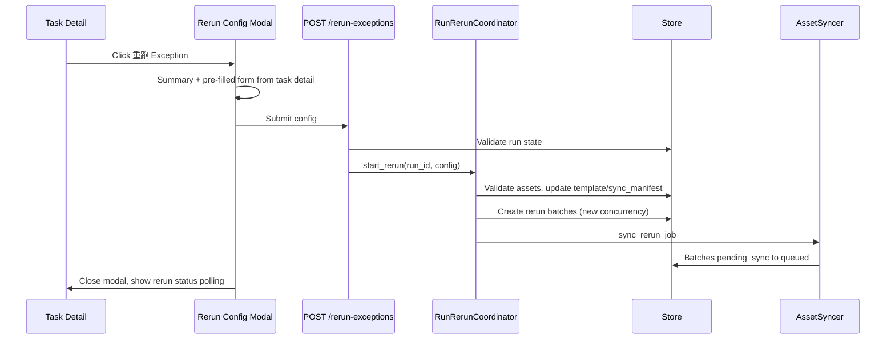

# Exception Rerun Configurable Parameters Design

## Goal

When operators click **重跑 Exception** on the Task detail page, show a configuration modal before starting the rerun. The editable parameters match the Create Task form (excluding task name, case selection, and worker selection). Defaults are pre-filled from the original run's stored configuration, and operators may adjust values before confirming.

## Non-Goals

This feature will **not**:

- Allow selecting a subset of exception cases (scope remains all exception cases).
- Allow reassigning cases to different workers.
- Create a new run or task template.
- Add a dedicated pre-fill API endpoint.
- Change exception rerun merge semantics, batch model, or worker claim protocol.

## Requirements Summary

| Decision | Choice |
|----------|--------|
| UI entry | Existing **重跑 Exception** button on Task detail |
| UI pattern | Modal dialog (stay on Task detail page) |
| Modal layout | Read-only summary header + editable form below |
| Case scope | Fixed to all exception cases; not shown, not editable |
| Worker assignment | Fixed to original workers; not shown, not editable |
| Editable fields | Per-worker concurrency, four timeout multipliers, dataset path, BitFun CLI path, BitFun config dir, jobs dir |
| Read-only fields in form | Executor kind, agent name (same as Create Task) |
| Summary header | Task name, exception count, involved worker count |
| Defaults source | `template`, `run.sync_manifest`, primary batch `batch_options` |
| Config persistence | Write updated config back to template and sync manifest before rerun starts |
| API change | Extend `POST /api/runs/{runId}/rerun-exceptions` request body |
| Backward compatibility | Empty body `{}` preserves current behavior |

## Chosen Approach

**Extend `POST /rerun-exceptions` request body + Modal** (recommended over a new GET config endpoint or redirect to Create page).

1. Frontend opens a modal pre-filled from existing `GET /api/eval-tasks/{runId}` data.
2. On confirm, POST config body to `/api/runs/{runId}/rerun-exceptions`.
3. Backend validates assets, updates template/sync manifest, then runs the existing rerun coordinator flow.

Alternatives considered:

| Approach | Verdict |
|----------|---------|
| Extend POST body + Modal | **Chosen** — minimal API surface, reuses task detail data, keeps user in context |
| New GET `/rerun-config` + Modal | Rejected — redundant with task detail payload |
| Redirect to Create page pre-filled | Rejected — poor UX, large frontend change |

## UI Design

### Trigger flow

1. User clicks **重跑 Exception** (existing enable/disable rules unchanged).
2. Modal opens with pre-filled form.
3. User edits parameters and clicks **确认重跑**, or **取消** to dismiss.
4. On success, modal closes and existing rerun status panel + polling begin.

### Modal structure

**Read-only summary** (top):

- Task name: `run.display_name`
- Exception count: `exceptionCount`
- Involved worker count: number of workers in `workerGroups` that have at least one exception case

**Editable form** (aligned with Create Task, minus excluded fields):

| Field | Default source |
|-------|----------------|
| Per Worker Concurrency | `template.executor_config.nConcurrent` or primary batch `batch_options.concurrency` |
| Timeout Multiplier | `template.executor_config.timeoutMultiplier` |
| Agent Timeout Multiplier | `template.executor_config.agentTimeoutMultiplier` |
| Verifier Timeout Multiplier | `template.executor_config.verifierTimeoutMultiplier` |
| Environment Build Multiplier | `template.executor_config.environmentBuildTimeoutMultiplier` |
| Dataset Path | `template.dataset_ref` or `run.sync_manifest.datasetPath` |
| BitFun CLI Path | `run.sync_manifest.bitfunCliPath` |
| BitFun Config Dir | `run.sync_manifest.bitfunConfigDir` |
| Jobs Dir | `template.executor_config.combinedJobsDir` |

**Read-only fields in form** (same placement as Create Task):

- Executor: `harbor-docker`
- Agent Name: `bitfun-cli`

**Excluded from modal**:

- Task Name
- Selected Case IDs
- Workers

### Frontend reuse

- Extract shared `collectTaskConfigPayload(form)` for Create and Rerun modals.
- Add `buildRerunFormDefaults(detail)` to derive defaults from task detail.
- Add static modal HTML alongside existing modals (`addWorkerModal`, etc.).

## API and Backend

### Request body

Extend `POST /api/runs/{runId}/rerun-exceptions`:

```json
{
  "datasetPath": "/path/to/dataset",
  "bitfunCliPath": "/path/to/bitfun-cli",
  "bitfunConfigDir": "/path/to/.config/bitfun",
  "jobsDir": "/path/to/harbor/jobs",
  "executorConfig": {
    "nConcurrent": 2,
    "timeoutMultiplier": 1.0,
    "agentTimeoutMultiplier": 3.0,
    "verifierTimeoutMultiplier": 2.0,
    "environmentBuildTimeoutMultiplier": 1.5
  }
}
```

- Empty body `{}` → use stored template/sync manifest/batch options (current behavior).
- Non-empty body → apply config before starting rerun.

### Processing order

```
POST /rerun-exceptions
  1. Validate run state (finished, no in-progress rerun, exceptionCount > 0)
  2. Parse optional config body
  3. If body contains config fields:
     a. group_exception_cases_by_worker → exception case_ids + involved worker_ids
     b. validate_create_task_assets() — paths exist; exception case dirs exist under datasetPath
     c. Rebuild executor_config via _build_asset_sync_executor_config()
        (worker_ids from exception grouping, not user input)
     d. Patch template.executor_config
     e. If datasetPath changed, update template.dataset_ref
     f. Patch run.sync_manifest (datasetPath, bitfunCliPath, bitfunConfigDir;
        preserve per-worker targetRoot, transport, sshHostAlias)
  4. Create rerun batches with batch_options.concurrency from body.executorConfig.nConcurrent
     (fallback: parent batch batch_options when body empty)
  5. Existing flow: create rerun job → sync_rerun_job → worker execute → merge
```

### Config persistence

Updated template and sync manifest are written before rerun starts. The next time the modal opens for the same run, defaults reflect the last submitted configuration.

### Unchanged rerun semantics

- Case scope: all exception cases via `group_exception_cases_by_worker`.
- Worker assignment: original worker per exception case.
- Asset sync: scoped to exception case subset + bitfun re-sync.
- Result merge: overwrite exception cases in parent batch.

## Error Handling

### Frontend

| Scenario | Behavior |
|----------|----------|
| Button disabled | Existing tooltip; do not open modal |
| Invalid form values | Client-side validation before submit (same rules as Create Task) |
| API 4xx | Show error in modal; keep modal open for retry |
| API 201 | Close modal; start rerun polling |

### Backend

| Scenario | HTTP | Behavior |
|----------|------|----------|
| Run not finished / rerun in progress / no exceptions | 409 / 400 | Unchanged; do not modify template |
| Invalid datasetPath / bitfunCliPath / bitfunConfigDir | 400 | Validation failure; no rerun started |
| Exception case missing under new datasetPath | 400 | Error lists missing case_id |
| Config applied but sync fails | — | `rerun_status=failed`; parent data unchanged |
| Empty body `{}` | 201 | Backward compatible |

### Edge cases

- **Timeout/concurrency only change**: Update `template.executor_config`; sync still scoped to exception subset.
- **datasetPath change**: Validate all exception cases exist under new path; update sync manifest; re-sync cases.
- **bitfun path change**: Update sync manifest; re-sync bitfun assets.
- **jobsDir change**: Update `executor_config.combinedJobsDir`; affects worker Harbor jobs output path.

## Testing

### Unit

- `RunRerunCoordinator.start_rerun()` applies config body and updates template/sync manifest.
- Empty body `{}` regression: behavior unchanged from pre-feature implementation.
- `batch_options.concurrency` taken from body `nConcurrent`.
- Invalid paths or missing case directories → error before rerun job creation.

### API

- Happy path with full config body.
- 400 on invalid datasetPath.
- Empty body backward compatibility.

### Manual UI

- Modal pre-fill matches stored run config.
- Summary shows correct exception and worker counts.
- Submit closes modal and rerun polling works.

## Architecture



## File Touch List (implementation hint)

| File | Change |
|------|--------|
| `src/agent_eval_orchestrator/controller/static.py` | Rerun modal HTML, form helpers, wire button to modal |
| `src/agent_eval_orchestrator/controller/run_rerun_coordinator.py` | Accept optional config; apply before rerun |
| `src/agent_eval_orchestrator/controller/server.py` | Parse POST body; pass config to coordinator |
| `src/agent_eval_orchestrator/storage/store.py` | Optional: update `template.dataset_ref` helper |
| `tests/controller/test_rerun_exceptions_api.py` | Config body happy path and validation |
| `tests/controller/test_run_rerun_coordinator.py` | Config application unit tests |
